<h1 align="center">
BookBazaar
</h1>

This is a fully functional e-commerce **Bookstore** application built using the MERN stack (MongoDB, Express, React, and Node.js). It includes features like JWT authentication, Google login integration, CRUD operations, and responsive design for both desktop and mobile views. 

## Table of Contents

- [Project Overview](#project-overview)
- [Features](#features)
- [Tech Stack](#tech-stack)
- [Installation](#installation)
- [Environment Variables](#environment-variables)
- [Usage](#usage)
- [Authentication](#authentication)
- [Responsive Design](#responsive-design)
- [Error Handling](#error-handling)
- [Security Measures](#security-measures)
- [Folder Structure](#folder-structure)
- [Contributing](#contributing)

## Project Overview

This project is a **Bookstore** web application where users can register, log in, browse books, and perform CRUD operations such as creating, editing, and deleting books. The authentication is handled using **JWT tokens** and **Google OAuth** for seamless login, and the application is designed to be responsive for both desktop and mobile views.

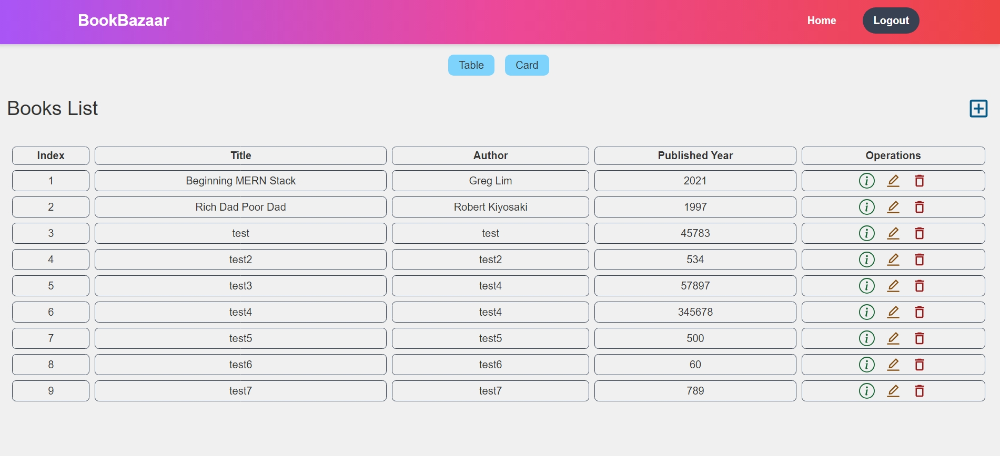
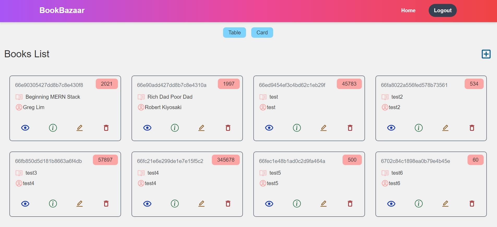

## Features

- **JWT Authentication**: Secure authentication with access and refresh tokens.
- **Google Login Integration**: Users can log in with their Google accounts.
- **Responsive Design**: Fully optimized for both mobile and desktop views.
- **CRUD Operations**: Create, read, update, and delete operations for books.
- **Protected Routes**: Only authenticated users can access specific routes.
- **Token Expiry Handling**: Token expiry managed using `Axios` interceptors.
- **Modern UI/UX**: Clean and modern design with Tailwind CSS and React Icons.
- **Navigation Bar**: A responsive and dynamically updating Navbar.
<p align="center">
  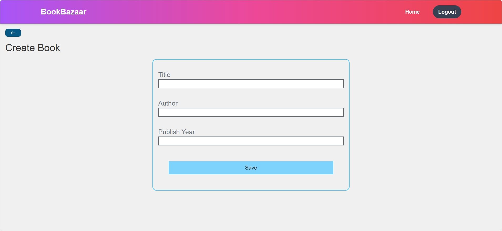
  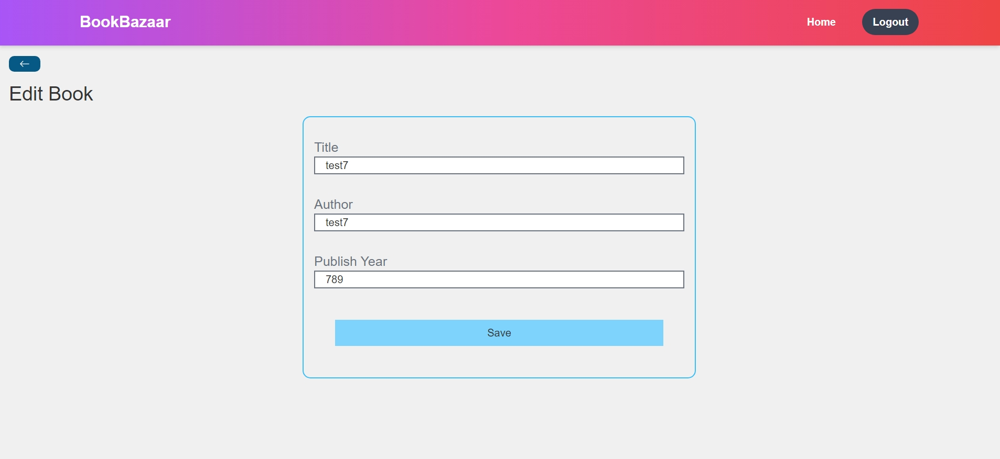
  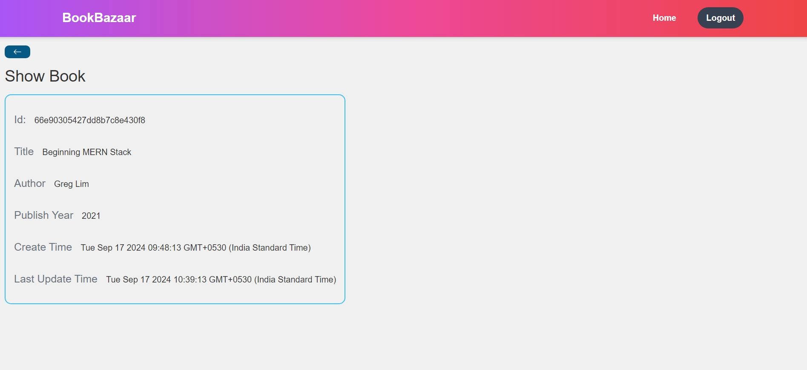
  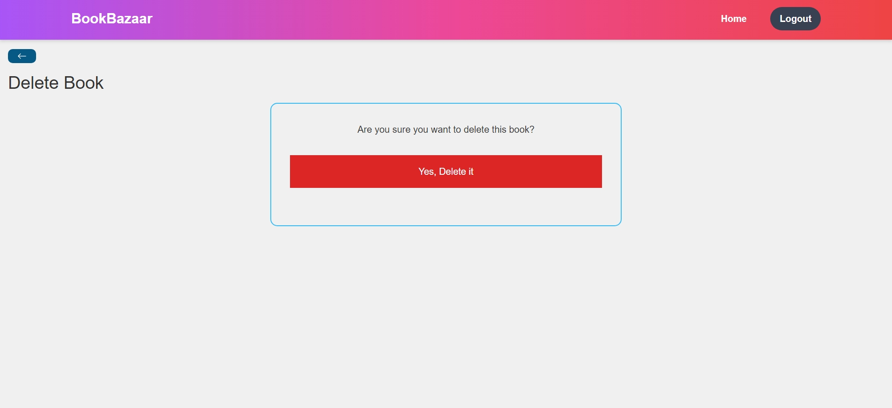
</p>

  
## Tech Stack

- **Frontend**: React, Axios, Tailwind CSS, React Icons
- **Backend**: Node.js, Express.js
- **Database**: MongoDB (Free shared MongoDB instance used)
- **Authentication**: JWT (JSON Web Tokens), Google OAuth, Passport.js
- **Deployment**: [Render](https://render.com/), GitHub

## Installation

To run the project locally, follow these steps:

1. Clone the repository:

   ```bash
   git clone https://github.com/your-username/bookstore-mern.git
   cd bookstore-mern
   ```

2. Install the dependencies for both frontend and backend:
    ```bash
    # Install backend dependencies
    cd backend
    npm install

    # Install frontend dependencies
    cd ../frontend
    npm install
    ```
    
## Environment Variables 

  Create a .env file in the backend directory and set the following environment variables:
  
  ```bash
  PORT=3000
  MONGO_URI=your-mongo-uri
  JWT_SECRET=your-jwt-secret
  SECRET_KEY=your-secret-key
  GOOGLE_clientID=your-google-client-id
  GOOGLE_clientSecret=your-google-client-secret
  GOOGLE_callbackURL=http://localhost:3000/auth/google/callback
  ```

  ## Usage

  To start the project, use the following commands:

  1. Start the backend server:

     ```bash
     cd backend
     npm start
     ```
  2. Start the frontend development server:

    ```bash
    cd frontend
    npm start
    ```

  Open your browser and navigate to http://localhost:3000 to explore the bookstore!

  ## Authentication

  - JWT Authentication: The user is authenticated via JWT tokens stored in cookies. The httpOnly option is used to ensure     that cookies are not accessible via JavaScript, adding a layer of security.
  - Google OAuth: You can log in using your Google account. On successful login, the system generates a JWT token.
  ### Login
   <p align="center">
      
      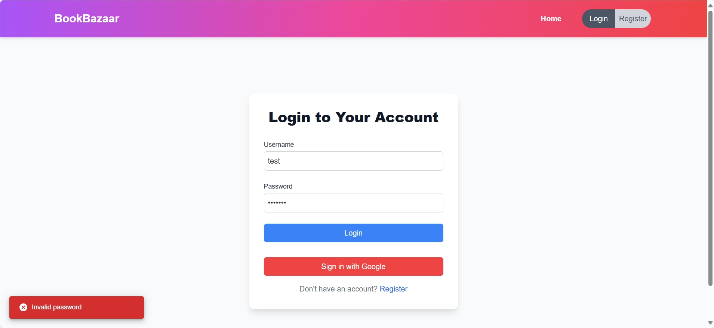
      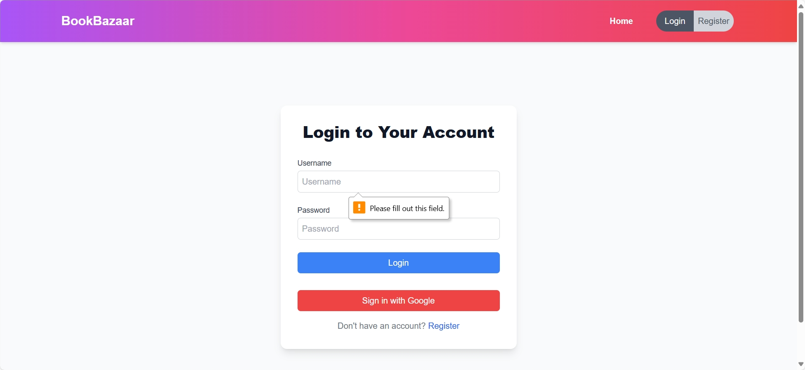
    </p>
    
  ### Register
  <p align="center">
    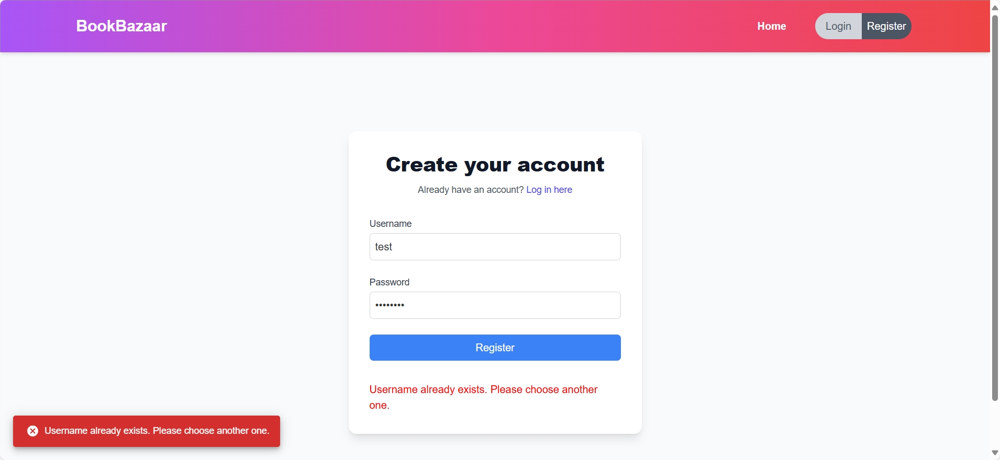
    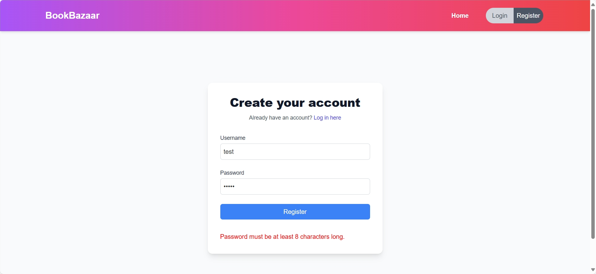
    
  </p>

  ### Notification
  <p align="center">
    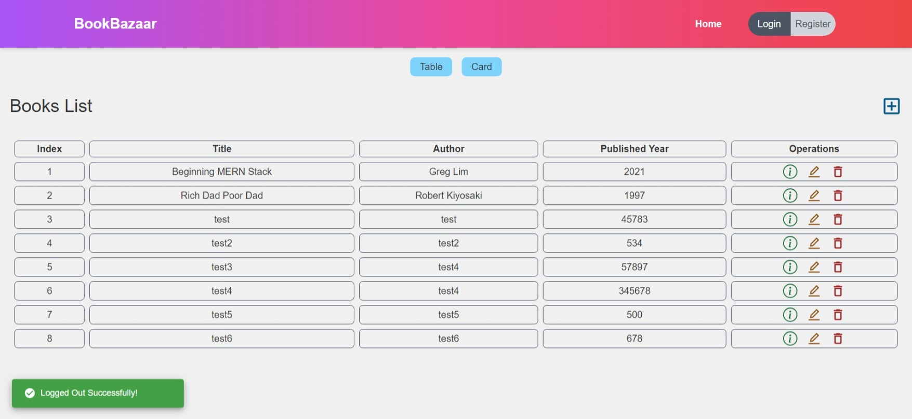
    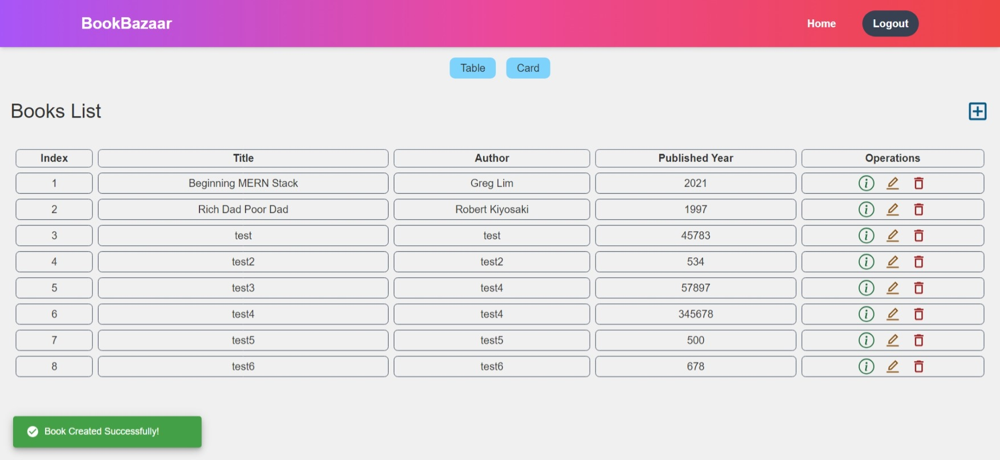
    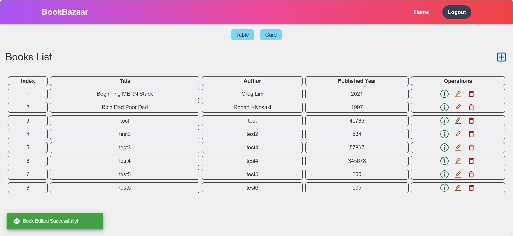
  </p>

  ## Responsive Design

  - The Navbar and CRUD operations are designed to be responsive. On mobile views, the navbar includes a sliding menu that opens from the right side.
  - Buttons, forms, and inputs are optimized for smaller screens to ensure smooth navigation and ease of use.
    
    <p align="center">
      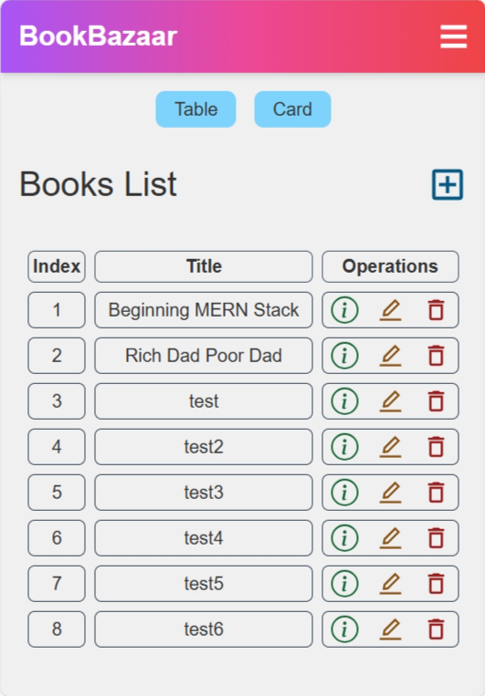
      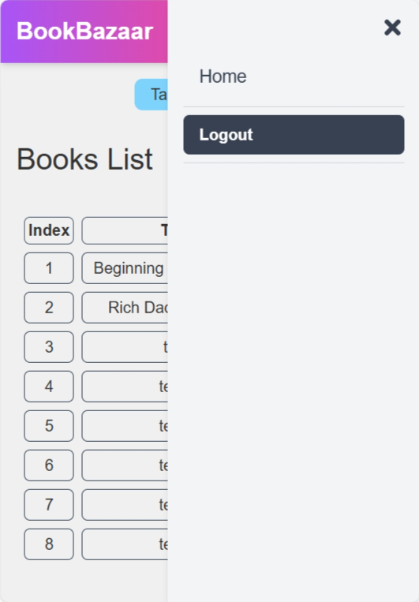
    </p>

  ## Error Handling

  - Token expiration is handled using Axios Interceptors in the frontend. When a token expires, the user is alerted, and they are navigated to the login page.
  - The server sends meaningful error messages in the event of authentication or authorization issues.

  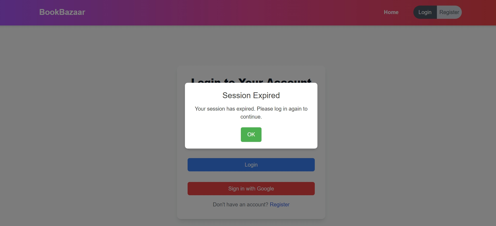
  
  ## Token Expiry Handling
  
  If the JWT token expires before the cookie, it will cause failed authentication attempts. You can adjust expiration times by:

  - Setting the JWT token and cookie expiration times to be consistent.
  - Implementing token refresh mechanisms for a better user experience.
  
  ## Security Measures
  
  - httpOnly Cookies: The JWT token is stored in cookies with the httpOnly flag, preventing client-side JavaScript access.
  - Environment Variables: Sensitive keys such as JWT secret, Google client IDs, and MongoDB URIs are stored in environment variables.
  - Token Expiration: The token expiry is handled to force re-authentication and protect the app from unauthorized access.
  - CORS: Proper CORS configuration is applied to allow only trusted domains.
  
  ## Folder Structure

  ```bash
  bookstore-mern/
  ├── backend/
  |   │   ├── models/            # Mongoose models (User, Book)
  |   |   |   ├── BookModel.js
  |   |   |   ├── User.js
  |   │   ├── routes/            # API routes (Auth, Books)
  |   |   |   ├── auth.js
  |   |   |   ├── bookRoute.js
  |   |   |   ├── login.js
  |   |   |   ├── register.js
  |   │   ├── config.js/         # Configuration files (Passport, JWT)
  |   │   |   └── passport.js   
  |   │   ├── .env               # Environment variables
  |   |   ├── index.js
  |   |   ├── package-lock.json
  |   |   └── package.json
  └── frontend/
      ├── src/
      │   ├── components/         # Reusable UI components (Navbar, BookCards)
      |   |   ├── home
      |   |   |   ├── BookModal.jsx
      |   |   |   ├── BookCard.jsx
      |   |   |   ├── BookCard.jsx
      |   |   |   ├── BookCard.jsx
      |   |   ├── BookButton.jsx
      |   |   ├── Navbar.jsx
      |   |   └── Spinner.jsx
      │   ├── pages/              # Page components (Home, ShowBook, EditBook)
      |   |   ├── CreateBook.jsx
      |   |   ├── DeleteBook.jsx
      |   |   ├── EditBook.jsx
      |   |   ├── Home.jsx
      |   |   ├── Login.jsx
      |   |   ├── NotFound.jsx
      |   |   ├── Register.jsx
      |   |   ├── ShowBook.jsx
      │   └── App.jsx             # Main React component
      |   ├── index.css
      |   ├── main.jsx
      |   ├── index.html
      |   ├── package-lock.json
      |   └── package.json
      |   ├── postcss.config.js
      |   └── tailwind.config.js
      |   └── vite.config.js
      └── public/                 # Static assets (favicon, images)
  ```

  ## Contributing
  
  Contributions are welcome! Feel free to submit issues, fork the repository, and send pull requests.

  ---
  Happy Coding!🚀

  
  
  

